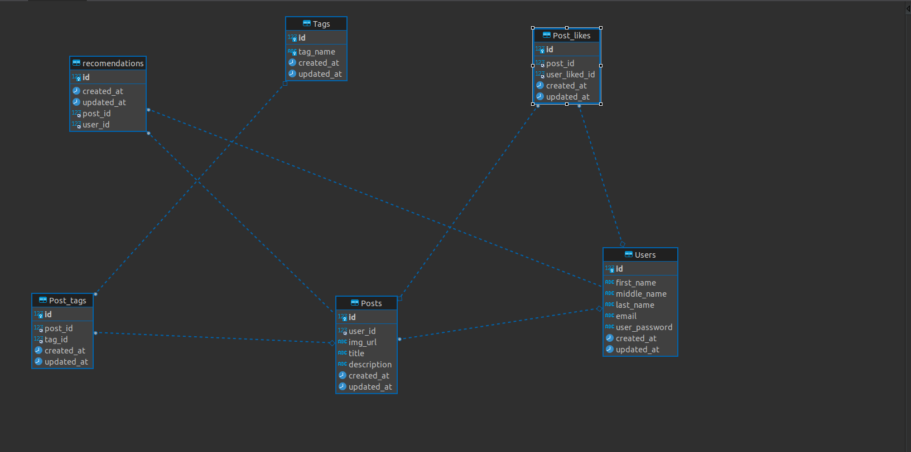

# Trabalho final de banco de dados
#### Alunos
- João Pedro Viana Bezerra
- Eduardo Sousa Lima
- Breno Cauã Prestes
- Emerson Sousa 
- Alender Marcel Silva Melo


### Domínio de problema 
- Banco de dados  modelado para gerênciar curtidas de usuários em posts e com base nas tags de cada post oferecer recomendações
- Banco chamado de pinterest por ser uma inspíração para o trabalho

#### Divisão do trabalho
- curl
> Contem requests para as APIs do projeto
- recomendations
> Contem a API em NODEJS usando EXPRESS para algumas operações com os dados mocados
- Seeds
> Pode ser considerado um peqeno Mock para o teste das APIS
> é possível importar as tabelas de csv para o mysql com
    ```
    LOAD DATA INFILE '/home/export_file.csv'
    INTO TABLE table_name
    FIELDS TERMINATED BY ','
    ENCLOSED BY '"'
    LINES TERMINATED BY '\n'
    IGNORE 1 ROWS;
```
-table
> Contém informações do banco de dados
    - procedures
        > Funções delimtadoores de uma curtida para cada post do usuario 
    - Triggers
        > Contém um trigger para cada  curtida de um usuário é executado uma seleção de dados recomendados
    - main.sql
        > Contem a criação do banco e sua modelagem
- upload-img
    > API feita em c# .net 6 para gerênciamento do envio de imagens usando DTO


### Instalação da API para rodar o C#
 https://tecadmin.net/how-to-install-dotnet-core-on-ubuntu-22-04/
- possivel erro: https://stackoverflow.com/questions/73753672/a-fatal-error-occurred-the-folder-usr-share-dotnet-host-fxr-does-not-exist
 dentro de upload-img  rodar o comando ```dotnet run```


### Instalaão para rodar a API em NODEJS com express
``` sudo apt install nodejs
    sudo apt install npm
    sudo apt-get update
```
dentro de reocomendations rodar
``` npm install ```
rodar em produção
``` npm start```
rodar em desenvolvimento
``` npm start dev ```


## Entidade Relacionamento




